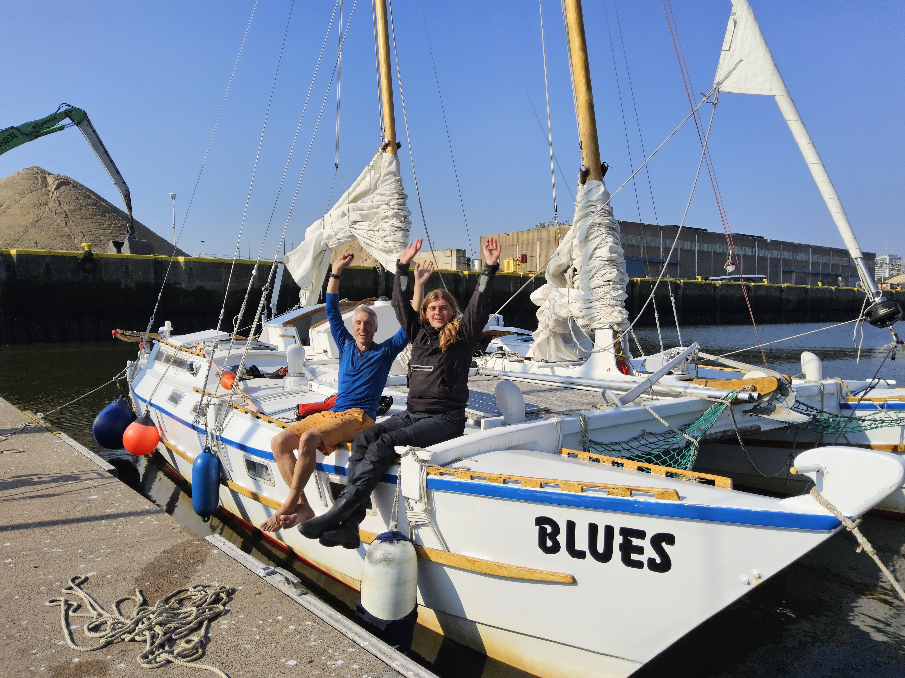
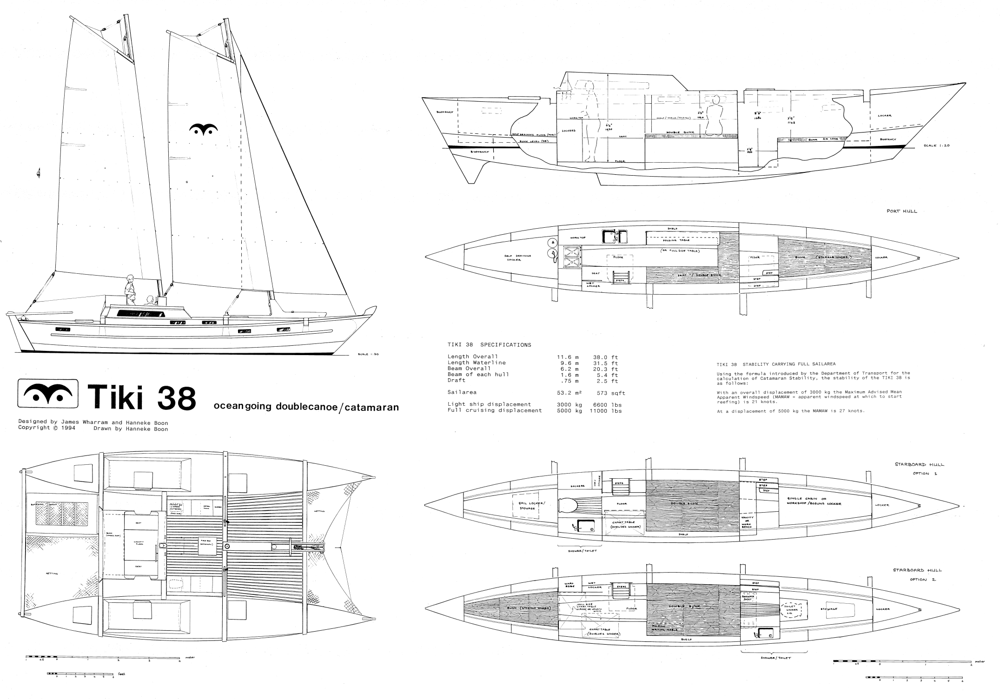

# Blues

a Tiki 38 Sailing Catamaran is the latest member of the "Love & Liberty" fleet

## Mission

> Promoting Love, Peace and Sustainability through Acts of Kindness and Fair Minimalism

## Quick Facts

Design by James Wharram, built 2018 in plywood + GRP

Length 11.6 meters (hull) / Width 6.2 meters

3 cabins (2 single, 1 double) = 4 bunks with privacy  
+ convertible double bunk in galley + oncall bunk in cockpit = 7 bunks total

## Crew

+ we have open crew positions to fill in November + December 2024 for sailing from Belgium to Portugal and Spain; please contact Lies or Boran

+ Lies (part-time)

+ Boran (full-time) as skipper

## Previous Crew

+ Mathilde (2024-09)
+ Bart (2024-09)
+ Lies (2024-09)
+ Boran (2024-09)
+ Bernhard (< 2024)

## Media

+ [Photo Album](https://photos.app.goo.gl/b41YA9pMvp2Wg4u2A)
